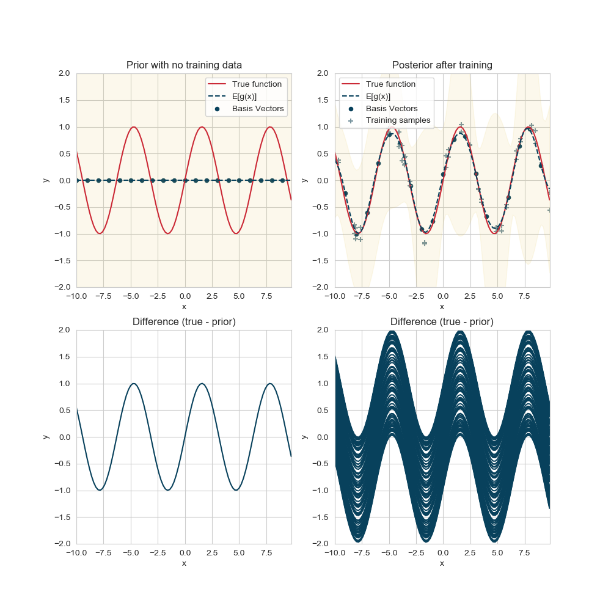

# Recursive Gaussian Process
This repository implements the Recursive Gaussian Process algorithm as described in [[1]](#1).

After choosing a set of m basis vectors, we can use the algorithm to update their mean and covariance recursively. 
All the information about the regressor is stored in the basis vector estimate and its covariance. 
We can use this algorithm to learn on a large amount of data n, while keeping the memory requirements roughly $O(m + m^2)$ (mean + covariance matrix). 
The computational requirements are also vastly reduced.

## Example

## References
<a id="1">[1]</a> 
Huber, M. F. (2014). Recursive Gaussian process: On-line regression and learning. Pattern Recognition Letters, 45, 85-91.
